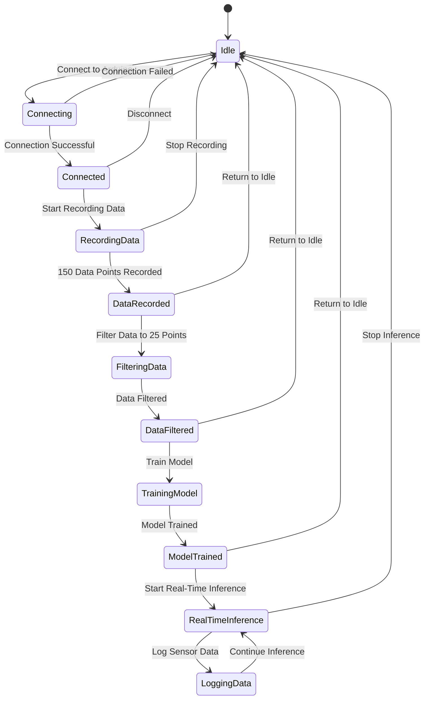

# Explanation of the E-Nose Project: Hardware and Software Details

## **Introduction**

The **E-Nose Project** is a system designed to detect and classify smells using an array of **MQ gas sensors** and a **machine learning model**. The system consists of a **microcontroller (MCU)** to read sensor data and a **Python (Qt) interface** to record data, train a model, and perform real-time inference. This project is ideal for applications such as environmental monitoring, industrial safety, food quality control, and home safety (e.g., gas leak detection).

This document provides a detailed explanation of the hardware and software components used in the project, including the rationale behind the selection of specific MQ sensor modules.

---

## **Hardware Components**

### **1. Microcontroller (MCU)**

The microcontroller is the brain of the E-Nose system. It reads data from the MQ sensors and sends it to the computer via serial communication. The choice of MCU depends on the number of sensors and the complexity of the setup.

- **Recommended MCUs**:
  
  - **Arduino Nano**: Suitable for small setups with a limited number of sensors.
  - **Arduino Mega**: Ideal for larger setups with multiple clusters of sensors, as it has more analog and digital pins.
  - **ESP32**: Offers Wi-Fi connectivity, making it suitable for IoT applications.
  - **STM32**: Provides high performance and is suitable for more advanced projects.

- **Key Requirements**:
  
  - At least **1 analog pin** for reading sensor data.
  - If using multiplexers, ensure the MCU has enough digital pins for multiplexer control.

### **2. MQ Gas Sensors**

MQ sensors are a family of gas sensors that detect various gases and volatile organic compounds (VOCs). Each MQ sensor is sensitive to specific gases, making them suitable for different applications.

#### **Why Use MQ Sensors?**

- **Cost-Effective**: MQ sensors are relatively inexpensive compared to other gas sensors.
- **Wide Range of Detection**: Each MQ sensor is designed to detect specific gases, allowing for a versatile gas detection system.
- **Analog Output**: MQ sensors provide analog output, making them easy to interface with microcontrollers.

#### **Specific MQ Sensors Used in the Project**:

1. **MQ-2**:
   
   - **Detects**: LPG, propane, methane, hydrogen, smoke.
   - **Applications**: Home safety (gas leak detection), industrial safety.
   - **Why Use It?**: MQ-2 is a general-purpose sensor that can detect a wide range of flammable gases, making it ideal for safety applications.

2. **MQ-3**:
   
   - **Detects**: Alcohol, ethanol, benzene.
   - **Applications**: Alcohol breathalyzers, industrial safety.
   - **Why Use It?**: MQ-3 is highly sensitive to alcohol, making it suitable for applications like breathalyzers or detecting alcohol vapors in industrial environments.

3. **MQ-4**:
   
   - **Detects**: Methane, natural gas.
   - **Applications**: Natural gas leak detection, environmental monitoring.
   - **Why Use It?**: MQ-4 is specifically designed to detect methane, which is a major component of natural gas, making it ideal for gas leak detection.

4. **MQ-6**:
   
   - **Detects**: LPG, butane, propane.
   - **Applications**: Home safety (LPG leak detection), industrial safety.
   - **Why Use It?**: MQ-6 is highly sensitive to LPG, making it suitable for detecting leaks in homes or industrial settings.

5. **MQ-135**:
   
   - **Detects**: Ammonia, benzene, alcohol, smoke, CO₂.
   - **Applications**: Air quality monitoring, industrial safety.
   - **Why Use It?**: MQ-135 is sensitive to a wide range of harmful gases, making it ideal for air quality monitoring and industrial safety applications.

6. **MQ-136**:
   
   - **Detects**: Hydrogen sulfide (H₂S).
   - **Applications**: Industrial safety (H₂S detection), environmental monitoring.
   - **Why Use It?**: MQ-136 is specifically designed to detect hydrogen sulfide, a toxic gas commonly found in industrial environments.

7. **MQ-138**:
   
   - **Detects**: Benzene, toluene, alcohol, acetone, propane, formaldehyde.
   - **Applications**: Air quality monitoring, industrial safety.
   - **Why Use It?**: MQ-138 is sensitive to a variety of VOCs, making it suitable for detecting harmful chemicals in the air.

8. **MQ-9**:
   
   - **Detects**: Carbon monoxide (CO), flammable gases.
   - **Applications**: Home safety (CO detection), industrial safety.
   - **Why Use It?**: MQ-9 is highly sensitive to carbon monoxide, a deadly gas, making it ideal for home safety applications.

### **3. Multiplexers (Optional)**

Multiplexers are used when the number of sensors exceeds the number of available analog pins on the MCU. The **CD74HC4067** is a 16-channel analog multiplexer that allows multiple sensors to share a single analog pin.

- **Why Use Multiplexers?**
  
  - **Expandability**: Multiplexers allow you to connect more sensors than the MCU's analog pins can handle.
  - **Cost-Effective**: Instead of using multiple MCUs, you can use a single MCU with multiplexers to read data from many sensors.

- **How It Works**:
  
  - The multiplexer selects one sensor at a time and routes its output to the MCU's analog pin.
  - The MCU controls the multiplexer using digital pins to select the desired sensor.

---

## **Software Components**

### **1. Arduino Code**

The Arduino code is responsible for reading data from the MQ sensors and sending it to the computer via serial communication. There are two versions of the code:

- **Single Sensor Setup**: Reads data from 8 MQ sensors connected directly to the analog pins.
- **Cluster Setup**: Reads data from multiple clusters of MQ sensors using multiplexers.

#### **Key Features of the Arduino Code**:

- **Data Acquisition**: The code reads analog values from the sensors and sends them to the computer.
- **Averaging (Cluster Setup)**: In the cluster setup, the code averages the readings from multiple clusters to improve accuracy.
- **Serial Communication**: The sensor data is sent to the computer in CSV format for further processing.

### **2. Python (Qt) Interface**

The Python interface is the main control center of the E-Nose system. It provides a graphical user interface (GUI) for recording data, training the machine learning model, and performing real-time inference.

#### **Key Features of the Python Interface**:

1. **Data Recording**:
   - The interface records 150 data points for each smell and filters them down to 25 points to minimize errors.
2. **Model Training**:
   - The recorded data is used to train an **Artificial Neural Network (ANN)** model.
   - The model can be trained using different algorithms, such as Random Forest, SVM, or MLP.
3. **Real-Time Inference**:
   - The trained model classifies smells in real-time based on sensor data.
4. **Data Logging**:
   - The interface logs sensor data and predictions for further analysis.
5. **Real-Time Graph**:
   - The interface visualizes sensor data in real-time using a graph.

#### **Python code states**:

#### **Python Libraries Used**:

- **PyQt5**: For creating the graphical user interface.
- **pyserial**: For serial communication with the Arduino.
- **numpy** and **pandas**: For data manipulation and analysis.
- **scikit-learn**: For training and evaluating the machine learning model.
- **matplotlib** and **pyqtgraph**: For data visualization.

---

## **Why Use Specific MQ Modules?**

The selection of MQ sensors in this project is based on their sensitivity to specific gases and their suitability for various applications. Here’s a breakdown of why each MQ sensor was chosen:

1. **MQ-2**: Chosen for its ability to detect a wide range of flammable gases, making it ideal for general safety applications.
2. **MQ-3**: Selected for its high sensitivity to alcohol, making it suitable for breathalyzers and industrial alcohol detection.
3. **MQ-4**: Used for its sensitivity to methane, which is crucial for natural gas leak detection.
4. **MQ-6**: Chosen for its high sensitivity to LPG, making it ideal for detecting LPG leaks in homes and industries.
5. **MQ-135**: Selected for its ability to detect harmful gases like ammonia and benzene, making it suitable for air quality monitoring.
6. **MQ-136**: Used for its sensitivity to hydrogen sulfide, a toxic gas commonly found in industrial environments.
7. **MQ-138**: Chosen for its ability to detect a variety of VOCs, making it suitable for detecting harmful chemicals in the air.
8. **MQ-9**: Selected for its sensitivity to carbon monoxide, a deadly gas, making it ideal for home safety applications.

By combining these sensors, the E-Nose system can detect a wide range of gases and VOCs, making it versatile and suitable for various applications.

---

## **Conclusion**

The E-Nose project is a versatile and cost-effective system for detecting and classifying smells using MQ gas sensors and machine learning. The hardware components, including the microcontroller and MQ sensors, are carefully selected to ensure accurate and reliable gas detection. The software components, including the Arduino code and Python interface, provide a user-friendly platform for data recording, model training, and real-time inference. The combination of specific MQ sensors allows the system to detect a wide range of gases, making it suitable for various applications, from home safety to industrial monitoring.

---

This document provides a comprehensive explanation of the hardware and software components used in the E-Nose project, along with the rationale behind the selection of specific MQ sensor modules.
